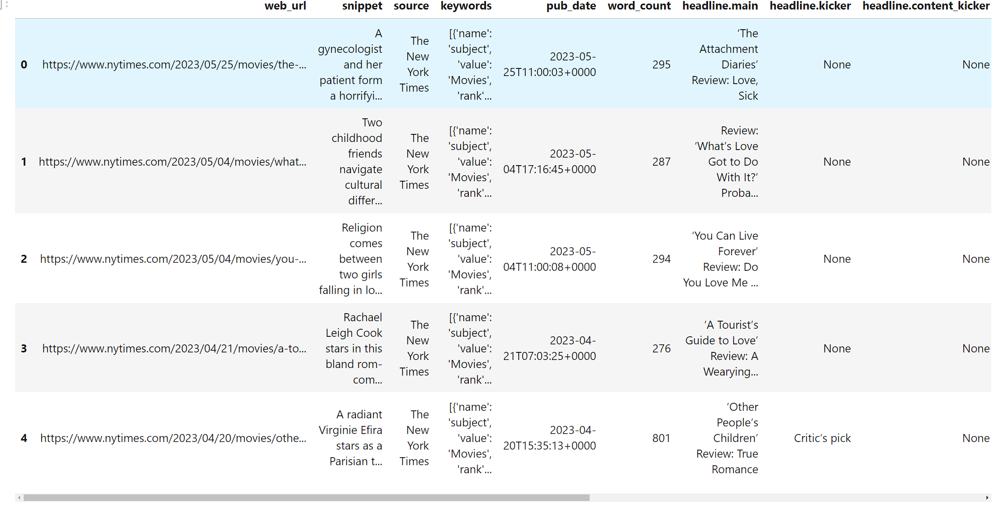
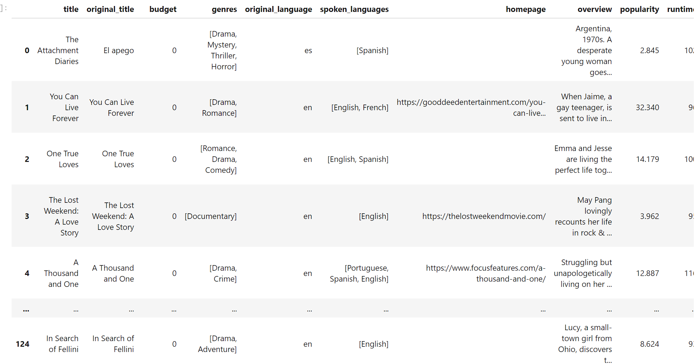
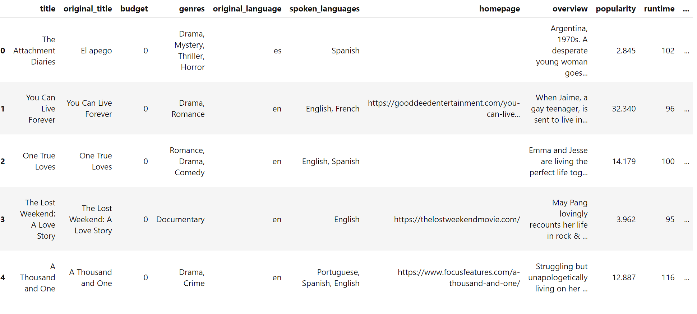
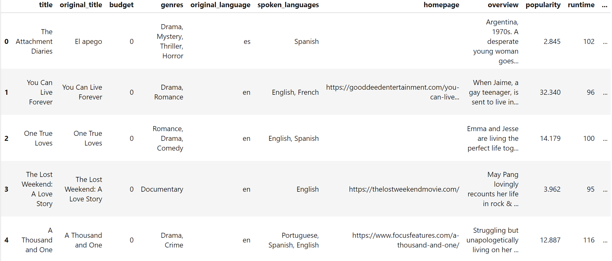

# data-sourcing-challenge
Module 6 Challenge

ACCESS THE NEW YORK TIMES API:
--------------------------------------------------------------------------------------------
The code was built out except for the API call, in block 5 we started with calling the 
API with query_url. The most important lesson I took from this is having the query_url
in with the for loop. The loop starts with a range to call each page, then requests.get
recieves the information in .json() using the json method. A sleep timer needed to be 
added because the API you can only request a certain of calls per minute. A try clause 
was there to make sure our for loop could keep running if we recieved a KeyError. Nothing
found on that page. 

query_url = f"{url}api-key={nyt_api_key}&fq={filter_query}&sort={sort}&fl={field_list}&begin_date={begin_date}&end_date={end_date}"
    query_url = f"{query_url}&page={str(page)}"

Next using the reviews_list that we append the json information into from the API call,
the first five reviews were printed, using json.dumps(). Next turn the reviews_list into 
a DataFrame using pd.json_normalize, then using head() to show the first five reviews in 
a DataFrame. 

From here we change the DataFrame Keywords list we make to regular text instead of a list 
of words, change headline.main to title for later in the project when we combine the 
DataFrames. After we are done populate the movie titles to a list and we are finished with
this section:

ACCESS THE MOVIE DATABASE API
--------------------------------------------------------------------------------------------
This one was more difficult building everything from scratch. The first thing was to build out 
the API call in a for loop. We start with the movie titles from titles in the previous section. 
We have a counter to see how many movies we are calling and a sleep timer of 1 second. We also
check to see in we have made 50 calls. If not we call the API with our query: 

query_url = f"{url}{search_title}{tmdb_key_string}"
url = "https://api.themoviedb.org/3/search/movie?query="
tmdb_key_string = "&api_key=" + tmdb_api_key

Then we use a try statement to get all the information we need from the API call, like 
spoken_languages, genres, production_countries. Which most of these variables are using a list
comprension to extract everything from the list into the variable so we can use that in our 
DataFrame. We append all data into tmdb_movies_list, then have the try statement tell us if 
"Found {title}" or "{title} not found". Which we did not find a decnet amount of information. 

From there we preview the json information using json.dumps(list, indent=4) which we see all our 
results. Turn the movie_list into a DataFrame. Then we using merge() to merge the tmdb_df and 
review_list_df from the new york times, and merge on the "title":

Then we move on to formatting all the cells removing the ', [, ] from the genres, spoken_languages
and production countries and change their data type to string instead of a list. We run through all 
columns and viola we have a easy to read columns:

 

Moving on to now dropping some columns which we do not need, we drop byline.person, drop_duplicates 
and then export to csv file using:

merge_df.to_csv('movie_review.csv', index=False)

The finished product looks like:

